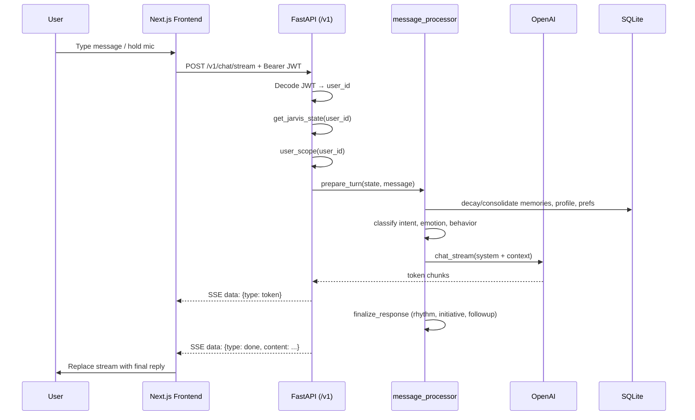

# JARVIS Companion — Implementation Notes

**Last updated:** 2026-06-05  
**API version:** 2.0.0 (`/v1/*` routes)  
**Prior baseline:** V1 notes dated 2026-05-30 (single-user, monolithic `api.py`, no auth)

---

## Known Bugs / Limitations

### Session & persistence

- **In-memory conversation history** — Each authenticated user gets one `JarvisState` in `state_store.py`. Conversation turns live in RAM only. Restarting the API server clears active chat history; SQLite memories (profile, personal memories, episodes, preferences) survive.
- **Frontend messages are ephemeral** — `useChat` keeps messages in React state. Refreshing the browser starts a new empty thread (the backend may still have the prior in-memory conversation until restart).
- **`thread_id` is a no-op** — `ChatRequest.thread_id` is accepted but not used. There is no persisted multi-thread chat yet.
- **Uncertain intent drops the user message** — If `classify_intent` returns `uncertain`, `prepare_turn` pops the user message from conversation before returning. The user sees a clarification reply, but that turn is not recorded in history.

### Auth & accounts

- **Dev JWT secret** — If `JWT_SECRET` is unset, `auth_jwt.py` falls back to `dev-insecure-secret-change-me`. Production requires `ENV=production` and a real `JWT_SECRET` (enforced at startup).
- **No password reset, email verification, or refresh tokens** — Register/login only; tokens expire after `JWT_EXPIRE_MINUTES` (default 7 days).
- **CLI uses a fixed user ID** — Terminal mode (`main.py`) runs as `CLI_USER_ID` (default `local-dev`), not a registered account.

### Voice

- **Gated by env + keys** — Voice UI only enables when `/health` reports `voice.available: true` (requires `VOICE_ENABLED=true`, `OPENAI_API_KEY`, and `ELEVENLABS_API_KEY`).
- **Generic 503 on voice errors** — Transcribe/TTS endpoints map most failures to `"Voice service unavailable"` to avoid leaking internals.
- **Browser mic permission** — Hold-to-talk (`VoiceButton`) needs Chrome (or similar) with microphone access.

### Memory & scale

- **SQLite only** — Single-file `memory.db`; no vector DB (Chroma/Pinecone), no horizontal scaling, no cloud sync.
- **Embedding search is lightweight** — Personal memories and reflections use stored embeddings in SQLite, not a dedicated vector index.
- **Runtime personality persists every 5 turns** — `persistence_policy.py` uses a fixed interval for all users; subscription tiers are stubbed (`TODO(subscription)`).
- **Preference changes clear in-memory engines** — `PUT /v1/preferences` and `POST /v1/preferences/reset-learned` call `clear_state(user_id)`, wiping the active session engines (not SQLite data).

### UX / streaming

- **Stream text may jump at end** — SSE sends raw LLM tokens, then a `done` event with the **post-processed** reply (`control_response`, rhythm, initiative, follow-ups). The UI intentionally replaces streamed text with `done.content`.
- **Onboarding required before chat** — `POST /v1/chat` and `/v1/chat/stream` return **409** with `needs_onboarding` until onboarding is complete.

### Migration

- **Existing `memory.db` from single-user mode** — Must run `migrations/001_add_user_id.py` and `migrations/002_companion_preferences.py` once before multi-user features work correctly.

### Deferred (not implemented)

- No `backend/` folder restructure
- No autonomous initiative, webcam, or V2 autonomy features
- No automated long-session soak tests or filled benchmark suite beyond `benchmarks.md` samples

---

## What Changed

Compared to the **2026-05-30 V1 baseline** documented in the previous version of this file:

### Architecture

| Area | V1 (before) | Current |
|------|-------------|---------|
| API layout | Monolithic `api.py` | `api/` package with routers; `api.py` is a thin shim |
| API routes | `/health`, `/chat`, `/chat/stream`, `/transcribe`, `/tts` | All under `/v1/*`; health stays at `/health` |
| Users | Single global session per server process | Per-user JWT auth + per-user `JarvisState` |
| Database | Single-user SQLite | Multi-user: `user_id` on all memory tables via `memory_scope.py` |
| Personality | Fixed `SYSTEM_PERSONALITY` in `llm.py` | YAML role templates + slider prefs + `prompt_builder.py` |

### New backend capabilities

- **Authentication** — `auth_store.py`, `auth_jwt.py`, `POST /v1/auth/register`, `POST /v1/auth/login`, `GET /v1/auth/me`
- **Onboarding** — 3-step wizard data model; `companion_prefs.py`; `POST /v1/onboarding/complete`; role catalog from `prompts/roles/*.yaml`
- **Preferences & profile** — `GET/PUT /v1/preferences`, `POST /v1/preferences/reset-learned`, `GET/PATCH /v1/profile`
- **Six companion roles** — `strategic_partner`, `fitness_coach`, `calm_companion`, `creative_sparring`, `productivity_operator`, `general_jarvis`
- **Learned style** — `preference_consolidation.py` writes `interaction_style` memories; `memory_recall.py` retrieves them for prompts
- **Runtime adaptation** — `personality_state.py` snapshots persisted to `companion_preferences.runtime_json` every 5 turns
- **Voice gating** — `voice_capabilities.py` + health payload `voice.enabled/stt_configured/tts_configured/available`
- **Structured logging** — `logging_config.py` + persistence cycle logs in `persistence_policy.py`
- **Migrations** — `migrations/001_add_user_id.py`, `migrations/002_companion_preferences.py`

### New frontend capabilities

- **Auth gate** — Register/login UI (`AuthGate.tsx`); JWT in `localStorage` (`companion_access_token`)
- **Onboarding wizard** — Role, communication style, energy, nickname (`OnboardingWizard.tsx`, `NicknamePicker.tsx`)
- **Settings panel** — Edit role, communication, energy, custom notes; reset learned style; change how JARVIS addresses you
- **Personalized greeting** — Empty chat state uses time-of-day + `address_as` (`greeting.ts`)
- **Dev token bypass** — `NEXT_PUBLIC_DEV_TOKEN` for API testing without login UI
- **Voice availability probe** — Mic/TTS controls hidden unless `/health` reports voice available

### Unchanged core (still present)

- **Turn pipeline** — `prepare_turn` → LLM (`chat` / `chat_stream`) → `finalize_response` in `message_processor.py`
- **Cognitive engines** — classifier, decision engine, reflection engine, curiosity, meta-cognition, rhythm, initiative, episodic memory, etc.
- **Three entry points** — Terminal (`main.py`), API (`uvicorn api:app`), Web (`frontend/`)
- **Flat Python layout** — Intelligence modules remain at project root (no `backend/` move)
- **SQLite + WAL** — `memory.py` with `timeout=30`, WAL mode, busy timeout

### Dependency additions

- `PyJWT`, `passlib[bcrypt]`, `bcrypt`, `email-validator`, `PyYAML` (see `requirements.txt`)

---

## Code Structure

```
companion/
├── main.py                    # Terminal entry (CLI_USER_ID, auto-onboarding for local-dev)
├── api.py                     # uvicorn shim → api.main:app
├── api/
│   ├── main.py                # FastAPI app, CORS, startup, exception handler
│   ├── deps.py                # JWT auth → user_id; get_state → JarvisState
│   ├── schemas.py             # Pydantic request/response models
│   └── routers/
│       ├── auth.py            # register, login, /me
│       ├── onboarding.py      # role catalog, complete onboarding
│       ├── preferences.py     # get/put prefs, reset learned style
│       ├── profile.py         # address_as, display name
│       ├── chat.py            # sync chat + SSE stream
│       ├── voice.py           # transcribe (Whisper), tts (ElevenLabs)
│       └── health.py          # DB ping + voice status
│
├── message_processor.py       # Core turn orchestration (prepare / finalize / process_message)
├── session_state.py           # JarvisState dataclass (engines + conversation)
├── state_store.py             # Per-user in-memory state cache + hydration
├── memory_scope.py            # ContextVar user_id for DB isolation
├── llm.py                     # OpenAI client, system prompt, chat/chat_stream
├── prompt_builder.py          # Assembles personality layer from prefs + roles
├── companion_prefs.py         # Onboarding, sliders, runtime_json persistence
├── persistence_policy.py      # Turn-based runtime persist interval
├── preference_consolidation.py# Learned interaction_style memories
├── memory.py                  # SQLite schema, connection, profile CRUD
├── personal_memory.py         # Extract/save/retrieve personal facts
├── memory_recall.py           # Style preference memory retrieval
├── memory_decay.py            # Memory decay on each turn
├── memory_consolidation.py    # Memory consolidation on each turn
├── memory_retriever.py        # Reflection retrieval (top 3)
├── episodic_memory.py         # Episode creation every 12 messages
├── auth_store.py / auth_jwt.py# Users table + JWT
├── voice_service.py           # Whisper STT + ElevenLabs TTS
├── voice_capabilities.py      # Voice feature flags and errors
├── config.py                  # Env vars (API keys, JWT, CORS, voice)
├── logging_config.py          # Logging setup
│
├── prompts/
│   ├── core.py                # Immutable JARVIS identity block
│   └── roles/*.yaml           # Per-role stance and emphasis
│
├── migrations/                # One-shot DB upgrade scripts
├── scripts/                   # QA phase scripts, ElevenLabs voice lister
│
├── frontend/                  # Next.js 15 + React 19 + Tailwind
│   └── src/
│       ├── app/               # page.tsx (chat shell), layout, globals.css
│       ├── components/        # AuthGate, OnboardingWizard, Chat*, Voice*, Settings*
│       ├── hooks/useChat.ts   # SSE streaming state
│       └── lib/api.ts         # All HTTP calls + token storage
│
├── memory.db                  # SQLite database (created/migrated at runtime)
├── requirements.txt
├── API.md                     # HTTP API reference
├── README.md                  # Quick start
└── benchmarks.md              # Response time log template
```

### Intelligence modules (project root)

These existed before V1 API work and are still called from `message_processor.py`:

`classifier.py`, `context_builder.py`, `conversation_manager.py`, `conversation_summarizer.py`, `curiosity_engine.py`, `decision_engine.py`, `embedding_engine.py`, `initiative_engine.py`, `internal_state.py`, `memory_intelligence.py`, `meta_cognition.py`, `personality_state.py`, `reasoning_engine.py`, `reflection_engine.py`, `response_controller.py`, `rhythm_engine.py`, `self_perception.py`, `thought_engine.py`

---

## Pipeline Overview

### End-to-end: Web chat



### `prepare_turn` (pre-LLM)

1. Memory maintenance — `decay_memories()`, `consolidate_memories()`
2. Load companion prefs into state if missing
3. Append user message; increment `turn_count`
4. Extract and save personal memories from user text
5. Emotion (VADER + `detect_emotion`) and intent (`classify_intent`)
6. Update internal engines — `internal_state`, `personality_state`, `self_perception`
7. Reflection topic detection and updates
8. If intent is `uncertain` → abort turn (message popped)
9. Build context — profile, patterns, personal memories, reflections, check-ins
10. `decide_behavior` using companion prefs
11. Curiosity question and follow-up preparation
12. Return `PreparedTurn`

### LLM call

- `prompt_builder.build_personality_layer` merges: `prompts/core.py` + role YAML + slider prefs + learned style memories + runtime personality snapshot
- `llm.build_system_message` adds profile, emotional state, behavior, memories, reasoning
- `chat_stream` (API) or `chat` (sync) calls OpenAI with optional conversation compression (>6 messages summarized)

### `finalize_response` (post-LLM)

1. `control_response` — tone/verbosity enforcement
2. `apply_rhythm` — pacing adjustments
3. `meta_cognition.evaluate_interaction`
4. Append initiative and curiosity follow-ups
5. Append assistant message to in-memory conversation
6. Every 12 messages → `create_episode` (SQLite)
7. Every 5 turns → `save_runtime_personality` to `companion_preferences.runtime_json`

### Voice path

1. **STT** — `VoiceButton` records audio → `POST /v1/transcribe` → `voice_service.transcribe_audio` (Whisper) → text sent as normal chat message
2. **TTS** — Play button on last assistant reply → `POST /v1/tts` → `voice_service.synthesize_speech` (ElevenLabs) → browser plays `audio/mpeg`

### Auth & onboarding path (first visit)

1. `AuthGate` checks `localStorage` token or `NEXT_PUBLIC_DEV_TOKEN`
2. `GET /v1/auth/me` → if `onboarding_completed: false`, show `OnboardingWizard`
3. Wizard → `POST /v1/onboarding/complete` → writes `companion_preferences` + profile (`address_as`, `name`)
4. Chat app loads → `GET /v1/profile`, `GET /health` (voice probe)
5. Messages → `POST /v1/chat/stream`

### Terminal path

`main.py` → `user_scope(CLI_USER_ID)` → auto-onboard if needed → `get_jarvis_state` → `process_message` (sync, prints `[RESPONSE TIME]`)

---

## How to Run

### Prerequisites

- **Python 3.11+** (project uses a `venv`)
- **Node.js 18+** and npm (for frontend)
- **OpenAI API key** (chat + Whisper STT)
- **ElevenLabs API key** (TTS only; optional if voice disabled)

### 1. Python environment

```bash
cd /Users/dagi/companion
python -m venv venv
source venv/bin/activate          # Windows: venv\Scripts\activate
pip install -r requirements.txt
```

Verify imports:

```bash
python -c "from api import app; print('OK')"
```

### 2. Environment variables

Create `.env` in the **project root** (same folder as `main.py`):

```env
OPENAI_API_KEY=sk-your-key-here

# Voice (optional — set VOICE_ENABLED=false to hide mic/TTS in UI)
ELEVENLABS_API_KEY=your-elevenlabs-key
ELEVENLABS_VOICE_ID=onwK4e9ZLuTAKqWW03F9
VOICE_ENABLED=true

# Auth
JWT_SECRET=change-me-in-production
JWT_EXPIRE_MINUTES=10080
CORS_ORIGINS=http://localhost:3000,http://127.0.0.1:3000

# Optional
DATABASE_PATH=memory.db
ENV=development
CLI_USER_ID=local-dev
```

### 3. Database migration (existing installs only)

If you have an older single-user `memory.db`:

```bash
python migrations/001_add_user_id.py
python migrations/002_companion_preferences.py
```

Fresh installs: `init_db()` runs on API startup and creates the full schema.

### 4. Start the API server

```bash
uvicorn api:app --reload --port 8000
```

Verify:

```bash
curl http://localhost:8000/health
# {"status":"ok","db":"ok","voice":{...}}
```

Optional auth + chat test:

```bash
# Register
curl -X POST http://localhost:8000/v1/auth/register \
  -H "Content-Type: application/json" \
  -d '{"email":"you@example.com","password":"password123"}'

# Use access_token from response, complete onboarding via API or the web UI, then:
curl -N -X POST http://localhost:8000/v1/chat/stream \
  -H "Content-Type: application/json" \
  -H "Authorization: Bearer <token>" \
  -d '{"message":"Hello"}'
```

### 5. Start the frontend

```bash
cd frontend
npm install
npm run dev
```

Open **http://localhost:3000** (API must be running on port 8000).

Create `frontend/.env.local` if the API is not on localhost:8000:

```env
NEXT_PUBLIC_API_URL=http://localhost:8000

# Optional: skip login UI during local API testing
# NEXT_PUBLIC_DEV_TOKEN=<valid-jwt>
```

### 6. First-run flow in the browser

1. Register or sign in
2. Complete the 3-step onboarding wizard (role, style, nickname)
3. Chat — text input or hold-to-talk (if voice is available)
4. Open **Settings** to change role, communication style, or reset learned preferences

### 7. Terminal mode (optional, no API)

```bash
python main.py
```

Uses `CLI_USER_ID` (default `local-dev`), auto-seeds onboarding, prints `[RESPONSE TIME]` each turn. Type `exit` to quit.

### 8. Voice smoke test

1. API running with `OPENAI_API_KEY`, `ELEVENLABS_API_KEY`, and `VOICE_ENABLED=true`
2. `/health` shows `"voice": {"available": true, ...}`
3. Frontend in Chrome with mic permission
4. Hold microphone → speak → release → confirm transcript sends and JARVIS replies
5. Click play on last assistant message for TTS

### Troubleshooting

| Symptom | Likely cause |
|---------|----------------|
| `ImportError` on startup | Run from project root; activate venv; `pip install -r requirements.txt` |
| Frontend can't connect | API not running; wrong `NEXT_PUBLIC_API_URL` |
| 401 on chat | Missing/expired token; sign in again |
| 409 `needs_onboarding` | Complete onboarding wizard or `POST /v1/onboarding/complete` |
| Stream text jumps at end | Expected — `done` event replaces raw tokens with post-processed reply |
| Voice controls hidden | `voice.available` is false — check keys and `VOICE_ENABLED` |
| Voice 503 | Missing API keys or `VOICE_ENABLED=false` |
| `JWT_SECRET must be set` | Set `JWT_SECRET` when `ENV=production` |

---

*For HTTP endpoint details, see [API.md](API.md). For a shorter quick start, see [README.md](README.md).*
