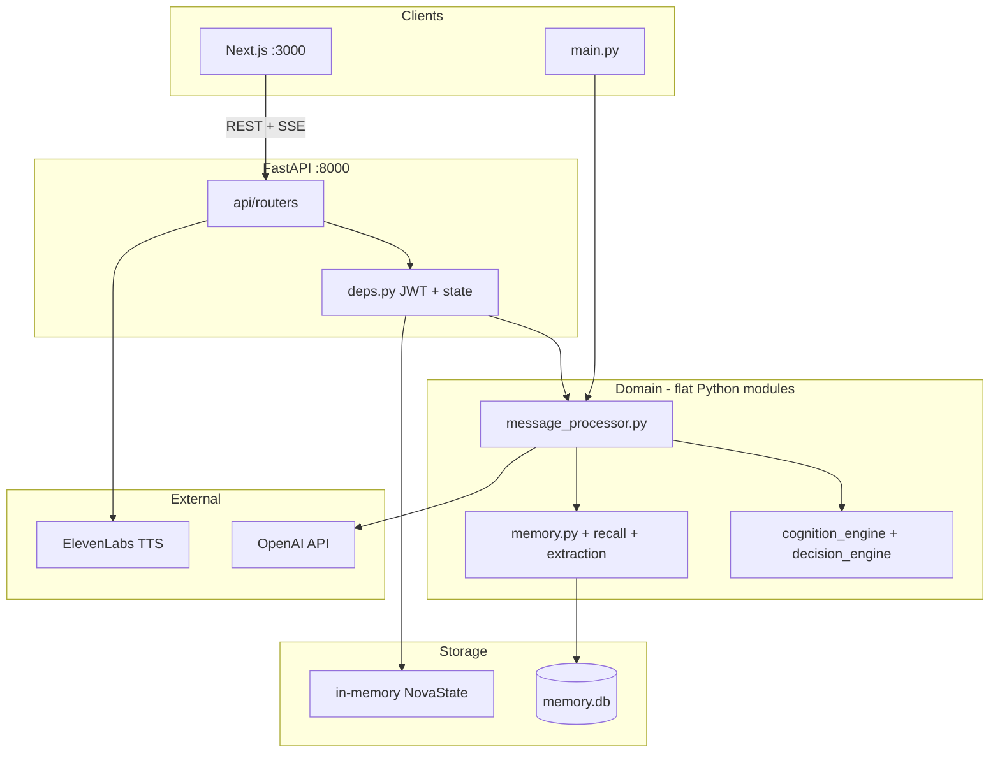

# Architecture

NOVA Companion is a locally run AI assistant with long-term memory, a cognition pipeline, and optional voice. Three entry points share one turn pipeline: terminal CLI (`main.py`), HTTP API (`uvicorn api:app`), and Next.js web UI (`frontend/`).

## System map



## Layering

The codebase uses a **thin HTTP layer, fat domain** layout:

| Layer | Location | Responsibility |
|-------|----------|----------------|
| Transport | `api/` | Routing, auth injection, Pydantic validation, CORS |
| Application | `message_processor.py` | Turn orchestration (prepare → LLM → finalize) |
| Domain | Root-level `*.py` modules | Cognition, memory, personality, voice |
| Persistence | `memory.py` | SQLite schema and queries |

Pydantic models live only in `api/schemas.py`. Domain code uses dataclasses and plain dicts. Routers never contain business rules — they validate input, set `user_scope`, and delegate.

There is no separate `services/` package. `message_processor.py` is the effective application service for chat.

## Turn lifecycle

Every user message flows through the same pipeline whether it arrives via CLI, sync HTTP, or SSE stream:

1. **prepare_turn** — Memory decay/consolidation, intent/emotion classification, internal state updates, memory recall, cognition generation, personality composition, behavior decisions, follow-up gating.
2. **LLM** — OpenAI streaming or sync completion with a system prompt built from role templates, preferences, recalled memories, and cognition output.
3. **finalize_response** — Response control, rhythm, meta-cognition, persist messages to SQLite, enqueue async memory extraction, episodic summarization on long threads, periodic runtime personality persistence.

On API startup, `init_db()` creates the SQLite schema and `memory_extraction_worker.py` starts a background poll loop (every ~5s) that processes insight-extraction jobs without blocking the hot path.

For SSE streaming, blocking phases are offloaded to worker threads via `asyncio.to_thread()` so the event loop stays responsive. See [decisions/0002-async-sse-thread-offload.md](decisions/0002-async-sse-thread-offload.md).

## Multi-tenancy

V2 added JWT auth and per-user isolation without rewriting every domain module:

```
Bearer token → api/deps.py → user_id → user_scope(user_id) → domain code
```

`memory_scope.py` sets a `ContextVar` for the current user. Legacy helpers like `get_profile()` read the scoped `user_id` internally. Routes and worker threads must enter `user_scope` before any DB access.

Each authenticated user gets a cached `NovaState` in `state_store.py` (1-hour TTL, thread-locked dict). State holds in-memory conversation history, personality engines, and turn counters. SQLite stores durable data: profiles, memories, conversations, preferences, extraction jobs.

See [decisions/0001-multi-user-sqlite-and-jwt.md](decisions/0001-multi-user-sqlite-and-jwt.md) for why SQLite + ContextVar was chosen over a full rewrite or vector DB.

## Auth split

Authentication is split across three concerns:

| Module | Role |
|--------|------|
| `auth_jwt.py` | JWT encode/decode (HS256, configurable expiry). No DB dependency. |
| `auth_store.py` | User CRUD in SQLite (`users` table), bcrypt password hashing. |
| `api/deps.py` | FastAPI `HTTPBearer` → decode token → validate user → inject `user_id` and `NovaState`. |
| `api/routers/auth.py` | HTTP endpoints: register, login, `/me`. |

Crypto stays separate from persistence so JWT logic can be tested without a database. HTTP security primitives stay in `api/` and never leak into domain modules.

## Session model

Hot session state lives in RAM; durable state lives in SQLite:

- **In-memory:** Last ~20 conversation turns, internal/personality/curiosity engines, turn count, companion preferences cache.
- **SQLite:** User accounts, personal memories, emotional history, reflections, episodes, conversation log, learned preferences, extraction jobs.

Runtime personality snapshots persist to `companion_preferences.runtime_json` every N turns (`persistence_policy.py`). Restarting the API clears active in-memory conversation history; SQLite data survives.

## Cognition

`cognition_engine.py` replaced separate thought and reasoning modules with a hybrid approach:

1. **Rules-first** — Fast, deterministic cognition for common cases.
2. **Optional mini-LLM** — When heuristics detect ambiguity (low confidence, emotional mismatch, reflection triggers, long threads), call `gpt-4o-mini` with a JSON schema.
3. **Fallback** — On LLM failure, use rules output.

Output feeds `decision_engine.py` (behavior knobs) and the LLM system prompt. See [decisions/0003-unified-cognition-engine.md](decisions/0003-unified-cognition-engine.md).

## Memory subsystem

Memory work splits into sync (hot path) and async (background):

| Phase | When | What |
|-------|------|------|
| Recall | `prepare_turn` | Retrieve personal memories, reflections, insights, learned preferences via embeddings in SQLite |
| Extraction | After turn | Enqueue job; worker calls LLM to extract insights from user message |
| Consolidation | Periodic | Aggregate insights into learned preferences; decay stale memories |
| Episodes | Every ~12 turns | Summarize conversation arc into episodic memory |

Follow-up questions are gated by policy in `memory_followups.py` (code decides *if*; LLM decides *how*).

## Frontend

Next.js App Router (`frontend/src/`):

- **Auth gate** — Register/login, JWT in `localStorage`, onboarding wizard before chat.
- **Chat** — `useChat` hook streams SSE from `POST /v1/chat/stream`.
- **Dev proxy** — `next.config.ts` rewrites `/v1/*` and `/health` to `http://127.0.0.1:8000` so the browser avoids CORS in local dev.

Optional BFF route at `frontend/src/app/v1/chat/stream/route.ts` can proxy SSE via `BACKEND_URL`; the main UI calls the API directly (or through Next rewrites).

## Operational constraints

These are intentional limits of the current design, not bugs to fix immediately:

- **Single SQLite file** — No vector DB, no horizontal scaling, no cloud sync.
- **In-memory sessions** — Conversation history in `NovaState` is lost on API restart; frontend React state is lost on browser refresh.
- **`thread_id` is a no-op** — Accepted in API but not used; no persisted multi-thread chat yet.
- **CLI uses a fixed user** — `main.py` runs as `CLI_USER_ID` (default `local-dev`), not a registered account.
- **Voice gated by env** — Requires `VOICE_ENABLED=true` plus OpenAI and ElevenLabs keys; `/health` reports availability.
- **No password reset or refresh tokens** — Register/login only; tokens expire after `JWT_EXPIRE_MINUTES`.

## Migrations

Fresh installs: `init_db()` on API startup creates the full schema. The scripts in `migrations/` (`001`–`005`) are for upgrading an existing `memory.db` from earlier versions — run them once if you have legacy data.

## Further reading

- [API reference](../API.md) — HTTP endpoints and request shapes
- [Architecture decisions](decisions/) — ADRs for major tradeoffs
- [CHANGELOG](../CHANGELOG.md) — Release history
