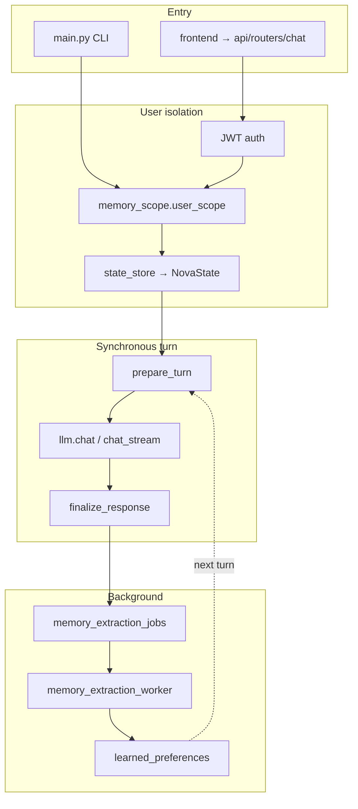

# NOVA Companion — Full Codebase Guided Tour

A top-to-bottom map of every file and folder in this project: what it is, why it exists, how it connects, and the patterns worth knowing. Read this after [README.md](../README.md) when you want a mental model of how everything fits together.

---

## Mental model first

**NOVA Companion** is a locally run, NOVA-style AI companion: Python backend (FastAPI + flat domain modules) + SQLite + Next.js frontend.

One chat turn flows like this:

### Three architectural pillars

1. **Multi-user isolation** — JWT identifies the user; [`memory_scope.py`](../memory_scope.py) sets a `ContextVar` so every DB call is scoped. In-memory session state lives in [`state_store.py`](../state_store.py) (1-hour TTL cache of [`NovaState`](../session_state.py)).
2. **Rules-first + optional LLM** — Cheap heuristics run synchronously; mini-LLM calls are gated (cognition, episode summaries, follow-up wording, insight extraction). Keeps latency predictable.
3. **Three-layer personality** — Onboarding sliders ([`companion_prefs.py`](../companion_prefs.py)) + learned style ([`learned_preferences.py`](../learned_preferences.py), async) + per-turn runtime modifiers ([`personality_composer.py`](../personality_composer.py)) → [`decision_engine.py`](../decision_engine.py) + [`prompt_builder.py`](../prompt_builder.py).

### Two memory tracks

- **Reflections** (topic + embedding, synchronous recall): [`reflection_engine.py`](../reflection_engine.py), [`memory_retriever.py`](../memory_retriever.py)
- **Episodes + insights + learned prefs** (async extraction, proactive follow-ups): [`episodic_memory.py`](../episodic_memory.py), [`memory_intelligence.py`](../memory_intelligence.py), [`memory_followups.py`](../memory_followups.py)

---

## Root directory

### Documentation and config

#### [`README.md`](../README.md)

1. **What:** Project front door — install, run, CLI, curl examples, migration order, personality summary.
2. **Why:** Onboarding doc for new contributors and users.
3. **Connects:** Points to [API.md](../API.md), this file, ADRs in [`docs/decisions/`](decisions/), [CHANGELOG.md](../CHANGELOG.md).

#### [`API.md`](../API.md)

1. **What:** Full HTTP reference for FastAPI 2.0 — every `/v1/*` route, auth, SSE streaming, voice, dev memory dashboard, env vars.
2. **Why:** Contract between backend and frontend; curl debugging.
3. **Connects:** Implemented in [`api/routers/`](../api/routers/); mirrored by [`frontend/src/lib/api.ts`](../frontend/src/lib/api.ts).

#### [`CHANGELOG.md`](../CHANGELOG.md)

1. **What:** Release history (Keep-a-Changelog format).
2. **Why:** Track what changed between versions.
3. **Connects:** Unreleased: NOVA rebrand, removal of `personal_memory.py`. v0.4: personality composer, async extraction, v2 prefs.

#### [`Future change.md`](../Future%20change.md)

1. **What:** Living roadmap — SSE threading fix, scaling tiers, SQLite/`NovaState` concurrency limits.
2. **Why:** Read before scaling beyond single-user dev.
3. **Connects:** Documents [`api/routers/chat.py`](../api/routers/chat.py) `asyncio.to_thread` pattern; ADR 0002.

#### [`benchmarks.md`](../benchmarks.md)

Manual latency log (~1.3–1.8s per turn). Informal; not CI-gated.

#### [`requirements.txt`](../requirements.txt)

Python deps: FastAPI, uvicorn, openai, vaderSentiment, numpy, PyJWT, passlib, etc.

#### [`.env.example`](../.env.example)

Template for backend secrets. Copy to `.env`.

#### [`.gitignore`](../.gitignore)

Ignores `.env*`, venv, `memory.db`, `node_modules`, `.next`, caches.

#### [`.env`](../.env) (local, gitignored)

Your actual API keys. Never commit.

#### [`memory.db`](../memory.db) (local, gitignored)

SQLite database created at runtime by [`memory.py`](../memory.py). Fresh installs use `init_db()`; upgrades use [`migrations/`](../migrations/).

#### `.DS_Store`

macOS folder metadata. Ignore.

### Entry points

#### [`main.py`](../main.py)

1. **What:** CLI REPL for local development.
2. **Why:** Fast iteration without the web UI or JWT.
3. **Connects:** `user_scope(CLI_USER_ID)` → auto-onboarding → `get_nova_state` → `process_message` loop.
4. **Pattern:** Thin shell; all cognition in [`message_processor.py`](../message_processor.py).

#### [`api.py`](../api.py)

Three-line shim: `from api.main import app` so `uvicorn api:app` works. Same turn pipeline as CLI.

---

## [`api/`](../api/) — HTTP layer

Thin FastAPI shell; all cognition stays in root Python modules.

### [`api/__init__.py`](../api/__init__.py)

Re-exports `app` from [`api/main.py`](../api/main.py).

### [`api/main.py`](../api/main.py) — Core HTTP bootstrap

1. **What:** FastAPI app factory and lifecycle.
2. **Why:** Single place for startup/shutdown, CORS, router mounting.
3. **Connects:** `init_db()`, memory extraction worker, all routers.
4. **Startup:** logging → DB init → start worker. **Shutdown:** stop worker. Validates JWT secret at import. Global 500 handler (re-raises `HTTPException`).

Routers mounted in order: health → auth → onboarding → preferences → profile → chat → voice → dev_memory.

### [`api/deps.py`](../api/deps.py)

1. **What:** Shared FastAPI dependencies.
2. **Why:** DRY auth and session injection.
3. **Connects:** `get_current_user` (Bearer JWT → `auth_jwt` → `auth_store`); `get_state` (+ `state_store.get_nova_state`).

### [`api/schemas.py`](../api/schemas.py)

Pydantic request/response models for all routers. Validation literals for sliders and `address_as` length.

### [`api/routers/`](../api/routers/)

| Router | Endpoints | Auth | Backend calls |
|--------|-----------|------|---------------|
| [`health.py`](../api/routers/health.py) | `GET /health` | None | SQLite ping, voice status |
| [`auth.py`](../api/routers/auth.py) | `/v1/auth/register`, `/login`, `/me` | `/me` JWT | `auth_store`, `auth_jwt`, onboarding check |
| [`onboarding.py`](../api/routers/onboarding.py) | `/v1/onboarding/roles`, `/complete` | `/complete` JWT | `companion_prefs.complete_onboarding` |
| [`preferences.py`](../api/routers/preferences.py) | GET/PUT prefs, learned, reset | JWT | `companion_prefs`, `learned_preferences`, `clear_state` |
| [`profile.py`](../api/routers/profile.py) | GET/PATCH `/v1/profile` | JWT | `memory.get_profile` / `set_profile` |
| [`chat.py`](../api/routers/chat.py) | POST `/v1/chat`, `/v1/chat/stream` | JWT + 409 if not onboarded | `message_processor`; SSE via `asyncio.to_thread` |
| [`voice.py`](../api/routers/voice.py) | `/v1/transcribe`, `/v1/tts` | JWT | `voice_service`, `voice_capabilities` |
| [`dev_memory.py`](../api/routers/dev_memory.py) | `/v1/dev/memory-extraction/*` | JWT; 404 in production | `memory_extraction_jobs` |

**Chat flow:** Auth → onboarding gate → `user_scope` → `get_nova_state` → same pipeline as CLI. Stream emits SSE `{type: token}` then `{type: done}`.

---

## Root Python — turn pipeline (read these first)

### [`message_processor.py`](../message_processor.py) — Orchestrator

1. **What:** Central hub for every chat turn.
2. **Why:** Keeps routers and CLI thin; one place to trace the pipeline.
3. **Exports:** `PreparedTurn`, `prepare_turn`, `finalize_response`, `process_message`, `stream_llm_tokens`.

**`prepare_turn`** (pre-LLM):

1. `decay_memories` + `consolidate_memories`
2. Load companion prefs; append user message; classify intent/emotion
3. Update internal/personality/self-perception state
4. Reflection write/check-in; emotional profile updates
5. Build context (retriever, insights, learned prefs)
6. `generate_cognition` → `decide_behavior` + cognition overrides
7. Optional curiosity question + episodic follow-up
8. Returns `PreparedTurn` or `None` (uncertain intent)

**`finalize_response`:** response_controller → rhythm → meta_cognition → append initiative/followup → persist messages → enqueue extraction job → maybe episode (every 12 turns) → runtime personality persist.

**`process_message`:** prepare → `llm.chat` → finalize.

### [`config.py`](../config.py)

Single env loader: OpenAI, JWT, DB path, CORS, voice flags. Everything imports from here.

### [`memory_scope.py`](../memory_scope.py)

1. **What:** Per-request user ID via `contextvars.ContextVar`.
2. **Why:** Multi-user SQLite without passing `user_id` through every function signature.
3. **Exports:** `set_user_id`, `require_user_id`, `user_scope` context manager.
4. **Pattern:** **Must wrap every authenticated request** before any DB access.

### [`llm.py`](../llm.py)

Builds system message ([`prompt_builder`](../prompt_builder.py) + [`prompts/core`](../prompts/core.py)), compresses old turns into a summary message, `chat` / `chat_stream`. Fallback string on API failure.

### [`cognition_engine.py`](../cognition_engine.py)

Rules-first cognition → optional `gpt-4o-mini` JSON. `CognitionResult` feeds decision engine and system prompt. LLM gated on ambiguous/emotional/long threads.

### [`decision_engine.py`](../decision_engine.py)

Maps intent + emotion + effective personality → behavior knobs (tone, verbosity, support). `apply_cognition_to_behavior` merges cognition overrides.

### [`memory.py`](../memory.py) — Persistence core

SQLite schema + CRUD: users, profiles, emotions, conversations, episodes, insights. WAL mode; `_ensure_schema_upgrades` on startup. Every query uses `require_user_id()`.

### [`state_store.py`](../state_store.py) + [`session_state.py`](../session_state.py)

Thread-safe 1-hour TTL cache of `NovaState` (conversation, turn_count, sub-engines). Hydrates from DB on miss. `NovaState` holds curiosity engine, internal state, meta-cognition, personality state, self-perception, VADER analyzer.

---

## Root Python — cognition and personality

| Module | What / connects |
|--------|-----------------|
| [`classifier.py`](../classifier.py) | Rule intent + VADER emotion; low confidence → `casual_talk` |
| [`internal_state.py`](../internal_state.py) | Simulated focus/energy/mood/trust; snapshot → LLM |
| [`personality_state.py`](../personality_state.py) | Rapport metrics (warmth, humor, relationship_depth); persisted via runtime_json |
| [`self_perception.py`](../self_perception.py) | Companion model of its own effectiveness |
| [`meta_cognition.py`](../meta_cognition.py) | Confidence/stability heuristics; evaluated in finalize |
| [`personality_composer.py`](../personality_composer.py) | Baseline + learned + runtime → `EffectivePersonality` |
| [`companion_prefs.py`](../companion_prefs.py) | Onboarding v2 sliders, runtime_json, role catalog (`general_nova` only) |
| [`prompt_builder.py`](../prompt_builder.py) | NOVA identity + slider instructions for system prompt |
| [`response_controller.py`](../response_controller.py) | Post-LLM safety: soften anxiety, banned words |
| [`rhythm_engine.py`](../rhythm_engine.py) | Stochastic openers/paragraph breaks |
| [`curiosity_engine.py`](../curiosity_engine.py) | Optional follow-up questions when cognition says `ask_question` |

---

## Root Python — memory subsystem

| Module | Sync/async | Purpose |
|--------|------------|---------|
| [`memory_decay.py`](../memory_decay.py) | Sync prep | Salience decay on reflections |
| [`memory_consolidation.py`](../memory_consolidation.py) | Sync prep | Boost recurring reflections |
| [`reflection_engine.py`](../reflection_engine.py) | Sync | Topic tags + embeddings + check-ins |
| [`memory_retriever.py`](../memory_retriever.py) | Sync | Semantic reflection recall |
| [`memory_recall.py`](../memory_recall.py) | Sync | Learned prefs → style snippets for cognition |
| [`memory_insights.py`](../memory_insights.py) | Read sync / write async | Recent insights for prompt |
| [`learned_preferences.py`](../learned_preferences.py) | Async aggregate | Promote insights → canonical prefs |
| [`memory_intelligence.py`](../memory_intelligence.py) | Async worker | LLM insight extraction JSON |
| [`episodic_memory.py`](../episodic_memory.py) | Finalize | Episodes every 12 turns; follow-up candidates |
| [`conversation_summarizer.py`](../conversation_summarizer.py) | Finalize | LLM episode summary |
| [`memory_followups.py`](../memory_followups.py) | Finalize | Ranked proactive follow-ups |
| [`memory_extraction_jobs.py`](../memory_extraction_jobs.py) | Finalize enqueue | Job queue + retry (60s/5m/15m) |
| [`memory_extraction_worker.py`](../memory_extraction_worker.py) | Background | Polls jobs, saves insights, aggregates prefs |
| [`persistence_policy.py`](../persistence_policy.py) | Finalize | When to flush runtime personality |
| [`embedding_engine.py`](../embedding_engine.py) | Reflections | OpenAI embeddings + cosine similarity |
| [`context_builder.py`](../context_builder.py) | Prepare | Context dict for LLM |

**Removed:** `personal_memory.py` — embedding recall of personal facts dropped in favor of insights + learned prefs. Legacy `personal_memories` tables are quarantined as `legacy_personal_memories_v3*` and are outside the V4 runtime contract.

---

## Root Python — auth and voice

| File | Notes |
|------|-------|
| [`auth_jwt.py`](../auth_jwt.py) | Create/decode JWT; dev secret fallback when `ENV=development` |
| [`auth_store.py`](../auth_store.py) | Register/login, bcrypt password hashing |
| [`voice_capabilities.py`](../voice_capabilities.py) | Feature gating from `VOICE_ENABLED` env |
| [`voice_service.py`](../voice_service.py) | Whisper STT + ElevenLabs TTS |
| [`logging_config.py`](../logging_config.py) | Shared logging setup for CLI and API |

---

## [`prompts/`](../prompts/)

### [`prompts/core.py`](../prompts/core.py)

1. **What:** Static `NOVA_CORE` system prompt — identity, warmth, addressing user, substance guidelines.
2. **Why:** Immutable character layer; user-specific data comes from elsewhere.
3. **Connects:** [`prompt_builder.py`](../prompt_builder.py) prepends this; QA scripts validate no hardcoded user names.
4. **Note:** No `prompts/__init__.py` — import `prompts.core` directly.

---

## [`frontend/`](../frontend/) — Next.js 15 UI

Dev proxy: [`next.config.ts`](../frontend/next.config.ts) rewrites `/v1/*` → `:8000`.

### Config (brief)

| File | Notes |
|------|-------|
| [`package.json`](../frontend/package.json) | `nova-frontend` 0.1.0; Next 15, React 19, Tailwind |
| [`package-lock.json`](../frontend/package-lock.json) | npm lockfile |
| [`tsconfig.json`](../frontend/tsconfig.json) | Strict TS, `@/*` paths |
| [`tailwind.config.ts`](../frontend/tailwind.config.ts) | `nova-*` dark theme tokens |
| [`postcss.config.mjs`](../frontend/postcss.config.mjs) | Tailwind PostCSS |
| [`next-env.d.ts`](../frontend/next-env.d.ts) | Next TS refs (generated) |
| [`.env.local.example`](../frontend/.env.local.example) | `NEXT_PUBLIC_API_URL` |

### [`src/app/`](../frontend/src/app/)

| File | Notes |
|------|-------|
| [`layout.tsx`](../frontend/src/app/layout.tsx) | Root layout, NOVA title, globals.css |
| [`page.tsx`](../frontend/src/app/page.tsx) | Main app: AuthGate → header, Settings, ChatWindow, ChatInput |
| [`globals.css`](../frontend/src/app/globals.css) | Tailwind + dark nova theme |
| [`dev/memory-extraction/page.tsx`](../frontend/src/app/dev/memory-extraction/page.tsx) | Dev dashboard polling extraction health |
| [`v1/chat/stream/route.ts`](../frontend/src/app/v1/chat/stream/route.ts) | Optional Node SSE proxy to backend |

### [`src/lib/`](../frontend/src/lib/)

| File | Notes |
|------|-------|
| [`api.ts`](../frontend/src/lib/api.ts) | Central client — JWT localStorage, all `/v1` calls, SSE `streamChat` |
| [`greeting.ts`](../frontend/src/lib/greeting.ts) | Time-of-day empty-state greeting |

### [`src/hooks/`](../frontend/src/hooks/)

| File | Notes |
|------|-------|
| [`useChat.ts`](../frontend/src/hooks/useChat.ts) | Messages state, SSE tokens → done, abort on resend |

### [`src/components/`](../frontend/src/components/)

| Component | Role |
|-----------|------|
| [`AuthGate.tsx`](../frontend/src/components/AuthGate.tsx) | Login/register, onboarding redirect |
| [`OnboardingWizard.tsx`](../frontend/src/components/OnboardingWizard.tsx) | 4-step slider wizard |
| [`SettingsPanel.tsx`](../frontend/src/components/SettingsPanel.tsx) | Prefs modal, nickname, reset learned |
| [`ChatWindow.tsx`](../frontend/src/components/ChatWindow.tsx) | Scroll + empty greeting |
| [`ChatInput.tsx`](../frontend/src/components/ChatInput.tsx) | Textarea + voice + send |
| [`MessageBubble.tsx`](../frontend/src/components/MessageBubble.tsx) | User/assistant bubbles |
| [`NicknamePicker.tsx`](../frontend/src/components/NicknamePicker.tsx) | `address_as` input |
| [`TypingIndicator.tsx`](../frontend/src/components/TypingIndicator.tsx) | Thinking dots |
| [`VoiceButton.tsx`](../frontend/src/components/VoiceButton.tsx) | Hold record → transcribe; TTS playback |

---

## [`migrations/`](../migrations/) — one-shot DB upgrades

Run in order on **existing** `memory.db` only; fresh install uses `init_db()`.

| Script | Adds |
|--------|------|
| [`001_add_user_id.py`](../migrations/001_add_user_id.py) | Multi-user `user_id`, legacy bucket |
| [`002_companion_preferences.py`](../migrations/002_companion_preferences.py) | `companion_preferences`, onboarding flag |
| [`003_conversations.py`](../migrations/003_conversations.py) | `conversations` table |
| [`004_followups.py`](../migrations/004_followups.py) | Episode resolved + followup cooldown |
| [`005_memory_extraction_jobs.py`](../migrations/005_memory_extraction_jobs.py) | Jobs, insights, learned prefs v2 |

---

## [`scripts/`](../scripts/) — manual QA

Requires API on `:8000`.

| Script | Covers |
|--------|--------|
| [`qa_phase_a.py`](../scripts/qa_phase_a.py) | Health, auth, migrations 001/002 |
| [`qa_phase_b.py`](../scripts/qa_phase_b.py) | Chat gate, onboarding, prefs |
| [`qa_phase_c.py`](../scripts/qa_phase_c.py) | Sync/stream chat, two-user isolation |
| [`qa_phase_d.py`](../scripts/qa_phase_d.py) | NOVA prompt, memory, reset-learned |
| [`qa_phase_e.py`](../scripts/qa_phase_e.py) | Edge cases, voice 503, CLI smoke |
| [`list_elevenlabs_voices.py`](../scripts/list_elevenlabs_voices.py) | List ElevenLabs voices for `.env` |

---

## [`tests/`](../tests/) — pytest (19 files)

Each file tests one domain module or API contract.

| Test file | Focus |
|-----------|-------|
| `test_auth_jwt.py` | JWT create/decode/secret |
| `test_chat_stream_threading.py` | SSE `to_thread` ordering |
| `test_cognition_engine.py` | Rules + LLM cognition |
| `test_companion_preferences_v2.py` | Onboarding v2 sliders |
| `test_conversation_summarizer.py` | Episode JSON summaries |
| `test_decision_engine_v2.py` | Effective personality → behavior |
| `test_dev_memory_router.py` | Dev routes hidden in prod |
| `test_episodic_memory.py` | Episode resolved flag |
| `test_internal_state.py` | InternalState updates |
| `test_learned_preferences.py` | Aggregation, conflicts, recall |
| `test_memory_extraction_storage.py` | Extraction tables, job retry |
| `test_memory_extraction_worker.py` | Worker processes jobs |
| `test_memory_followups.py` | Follow-up ranking/gates |
| `test_memory_intelligence.py` | Insight JSON parsing |
| `test_message_processor.py` | Full turn pipeline integration |
| `test_personality_composer.py` | Compose effective personality |
| `test_preferences_api_v2_contract.py` | Pydantic v2 shapes |
| `test_prompt_builder_v2.py` | NOVA prompt layers |
| `test_state_store_v2.py` | NovaState hydration |

Run: `python -m pytest tests/ -q`

---

## [`docs/`](.)

| File | Notes |
|------|-------|
| [`V4_SCOPE.md`](V4_SCOPE.md) | V4 tracker: rebrand done, memory WIP, concurrency planned |
| [`decisions/0001-multi-user-sqlite-and-jwt.md`](decisions/0001-multi-user-sqlite-and-jwt.md) | ADR: JWT + ContextVar + SQLite |
| [`decisions/0002-async-sse-thread-offload.md`](decisions/0002-async-sse-thread-offload.md) | ADR: `asyncio.to_thread` for chat |
| [`decisions/0003-unified-cognition-engine.md`](decisions/0003-unified-cognition-engine.md) | ADR: cognition_engine replaces old engines |
| **This file** | Full codebase guided tour |

---

## Root module quick index

Flat imports at repo root (no package subfolders except `api/`, `prompts/`, `migrations/`, `scripts/`, `tests/`, `frontend/`):

- **Entry:** `main.py`, `api.py`
- **Orchestration:** `message_processor.py`
- **LLM:** `llm.py`, `prompt_builder.py`
- **Cognition:** `classifier.py`, `cognition_engine.py`, `decision_engine.py`, `response_controller.py`, `rhythm_engine.py`, `curiosity_engine.py`, `internal_state.py`, `personality_state.py`, `self_perception.py`, `meta_cognition.py`, `personality_composer.py`
- **Memory:** `memory.py`, `memory_scope.py`, all `memory_*` modules, `learned_preferences.py`, `companion_prefs.py`, `embedding_engine.py`, `conversation_summarizer.py`, `persistence_policy.py`
- **Auth/voice:** `auth_jwt.py`, `auth_store.py`, `voice_capabilities.py`, `voice_service.py`
- **Infra:** `config.py`, `logging_config.py`, `state_store.py`, `session_state.py`

---

## How to navigate as a new developer

1. **Run:** [README.md](../README.md) → `uvicorn api:app` + `frontend npm run dev` OR `python main.py` CLI.
2. **One turn:** `message_processor.prepare_turn` → `llm.chat` → `finalize_response`.
3. **HTTP:** `api/routers/chat.py` wraps same pipeline with JWT + onboarding gate.
4. **Personality:** onboarding in `companion_prefs` → async `learned_preferences` → `personality_composer`.
5. **Scale/concurrency:** [Future change.md](../Future%20change.md) + ADR 0002 before multi-user load.

---

## File count summary

| Area | Files |
|------|-------|
| Root Python domain | ~43 |
| `api/` | 12 |
| `prompts/` | 1 |
| `frontend/src` | 18 |
| `migrations/` | 5 |
| `scripts/` | 6 |
| `tests/` | 19 |
| `docs/` | 5 |
| Root docs/config | 9 |

**Total tracked source ~113 files** (+ local `.env`, `memory.db`, `.DS_Store`).
